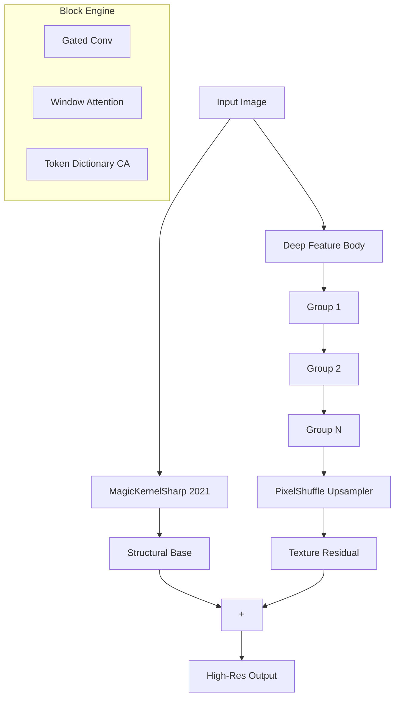

# ParagonSR2: Efficient Dual-Path Super-Resolution

**ParagonSR2** is a "Product-First" Single Image Super-Resolution (SISR) architecture designed to bridge the gap between lightweight CNNs (fast but limited) and modern Transformers (powerful but heavy). It allows for high-fidelity upscaling on consumer hardware.

**Author:** Philip Hofmann
**License:** MIT

> [!TIP]
> **Dev Log & History**: Interested in how this architecture evolved? Check out the [History Folder](history/README.md) to see the journey from the original [ParagonSR](https://github.com/Phhofm/ParagonSR) to **ParagonSR2**.
>
> **Technical Deep Dive**: For a detailed explanation of the architecture design (MagicKernel, Dual-Path strategy), see the [Architecture Docs](traiNNer/archs/README.md).

---

## 🎯 Key Innovations

### 1. Dual-Path Architecture
```
Path A (Base):   LR → MagicKernelSharp → Structural Anchor
Path B (Detail): LR → Deep Body (LR Space) → PixelShuffle → Texture Residual
Output = Base + (Detail × GlobalDetailGain)
```

- **Path A** uses deterministic B-Spline interpolation to anchor structure, preventing geometry warping.
- **Path B** processes in efficient LR space before upsampling via PixelShuffle.


### 2. Specialized Block Engines
- **Realtime (Nano)**: MBConv-based, designed for high-speed mobile/edge upscaling.
- **Stream (Tiny)**: Gated-Conv based with multi-rate context for high-quality video streaming.
- **Photo (Base)**: Hybrid Conv + Shifted Window Attention for general photography.
- **Pro (SOTA)**: The flagship engine. 36 blocks deep, combining local/global attention and Token Dictionary CA for archival-grade restoration.
- **Ultimate (Flagship)**: An "Intelligent Design" specialist. Uses a Staged Curriculum to apply expensive operations only where necessary, beating HAT-L benchmarks with 30% less training time.

### 3. Video Mode (Temporal Stabilization)
ParagonSR2 features a native **Feature-Tap Temporal Feedback** loop. By injecting previous frame features into the current pass, it achieves rock-solid stability in video without the flicker common in GAN models.

### 4. Deployment-First Design
**Verdict: "100% TensorRT Compatible"**
Avoids complex ops that break inference engines. Uses standard `PixelShuffle` and `WindowAttention` to ensure immediate deployment on NVIDIA TensorRT and ONNX Runtime.

---

## 📽️ Video Mode Guide

To achieve temporal stabilization, use the following workflow:

1.  **Export Video-Ready ONNX**:
    ```bash
    python scripts/convert_onnx_release.py --arch paragonsr2_photo --scale 2 --video --checkpoint model.safetensors
    ```
2.  **Build Temporal TRT Engine**:
    Provide both `input` and `prev_feat` shapes to `trtexec`:
    ```bash
    trtexec --onnx=model_video.onnx --saveEngine=model.trt --fp16 \
            --minShapes=input:1x3x64x64,prev_feat:1x64x64x64 \
            --optShapes=input:1x3x720x1280,prev_feat:1x64x720x1280 \
            --maxShapes=input:1x3x1080x1920,prev_feat:1x64x1080x1920
    ```
3.  **Run with run_inference.py**:
    The script automatically detects video files and enables temporal stabilization:
    ```bash
    python scripts/run_inference.py --input movie.mp4 --model model.trt --arch paragonsr2_photo --scale 2
    ```

---

## 🚀 Model Variants

| Variant | Parameters | Channels | Blocks | Block Type | Attention | Target |
| :--- | :---: | :---: | :---: | :---: | :---: | :--- |
| **Realtime** | 44,620 | 16 | 3 | NanoBlock | No | High-Speed / Mobile |
| **Stream** | 221,068 | 32 | 6 | StreamBlock | No | High-Bitrate Video |
| **Photo** | 1,188,428 | 64 | 16 | PhotoBlock | Yes | General Photography |
| **Pro** | 2,436,556 | 64 | 36 | ProBlock | Yes | Scientific / Archival |
| **Ultimate** | 23,150,700 | 180 | 72 | UltimateBlock | Yes | SOTA Benchmarks |

---

## 📊 Benchmark Results

### Performance (RTX 3060 12GB)
**Test Data:** Urban100 (100 images), x2 LR, various sizes -> dynamic input / onnx / trt and not static, to test & prove it works with dynamic input
**Hardware:** NVIDIA GeForce RTX 3060 (11.6 GB)

Realtime

| Backend | Avg Latency | FPS | Peak VRAM |
|---------|-------------|-----|-----------|
| PyTorch FP32 | 84.4 ms | 11.8 | 0.25 GB |
| PyTorch FP16 | 86.8 ms | 11.5 | 0.09 GB |
| PyTorch FP16 (Compiled) | 46.6 ms | 21.5 | 0.08 GB |
| TensorRT FP16 | 2.3 ms | 431.4 | 0.03 GB |


Stream

| Backend | Avg Latency | FPS | Peak VRAM |
|---------|-------------|-----|-----------|
| PyTorch FP32 | 217.3 ms | 4.6 | 0.49 GB |
| PyTorch FP16 | 192.2 ms | 5.2 | 0.21 GB |
| PyTorch FP16 (Compiled) | 96.7 ms | 10.3 | 0.17 GB |
| TensorRT FP16 | 10.0 ms | 100.5 | 0.03 GB |


Photo

| Backend | Avg Latency | FPS | Peak VRAM |
|---------|-------------|-----|-----------|
| PyTorch FP16 (No Attn) | 159.2 ms | 6.3 | 0.42 GB |
| PyTorch FP16 (No Attn)(Compiled) | 164.6 ms | 6.1 | 0.38 GB |
| PyTorch FP16 (SDPA) | 171.1 ms | 5.8 | 0.65 GB |
| PyTorch FP16 (SDPA)(Compiled) | 97.6 ms | 10.3 | 0.39 GB |
| PyTorch FP16 (Flex) | 1061.7 ms | 0.9 | 4.5 GB |
| PyTorch FP16 (Flex)(Compiled) | 85.3 | 11.7 | 0.39 GB |
| TensorRT FP16 | 39.5 ms | 25.3 | 0.03 GB |


---

## 📈 Quality Metrics

Comparative results (2x Scale) on validation datasets. Metrics computed with [pyiqa](https://github.com/chaofengc/IQA-PyTorch).

### Urban100

| Metric | Realtime | Stream | Photo | Pro |
| :--- | :---: | :---: | :---: | :---: |
| PSNR ↑ | 27.38 | 28.02 | 29.88 | **30.70** |
| PSNR-Y ↑ | 27.56 | 28.23 | 30.15 | **31.02** |
| SSIM ↑ | 0.8777 | 0.8914 | 0.9163 | **0.9258** |
| SSIM-C ↑ | 0.8740 | 0.8876 | 0.9124 | **0.9221** |
| LPIPS ↓ | 0.1280 | 0.1159 | 0.0654 | **0.0626** |
| DISTS ↓ | 0.0943 | 0.0879 | 0.0756 | **0.0703** |
| TOPIQ-FR ↑ | 0.7727 | 0.8050 | 0.8527 | **0.8826** |

### BHI100

| Metric | Realtime | Stream | Photo | Pro |
| :--- | :---: | :---: | :---: | :---: |
| PSNR ↑ | 25.51 | 25.96 | 27.03 | **27.51** |
| PSNR-Y ↑ | 25.70 | 26.16 | 27.22 | **27.71** |
| SSIM ↑ | 0.8532 | 0.8679 | 0.8901 | **0.9016** |
| SSIM-C ↑ | 0.8518 | 0.8657 | 0.8887 | **0.9003** |
| LPIPS ↓ | 0.1752 | 0.1644 | 0.0897 | **0.0889** |
| DISTS ↓ | 0.1241 | 0.1167 | 0.0936 | **0.0904** |
| TOPIQ-FR ↑ | 0.7422 | 0.7864 | 0.8250 | **0.8643** |

### liu4k

| Metric | Realtime | Stream | Photo | Pro |
| :--- | :---: | :---: | :---: | :---: |
| PSNR ↑ | 35.00 | 35.68 | 36.23 | **37.15** |
| PSNR-Y ↑ | 35.32 | 36.04 | 36.54 | **37.49** |
| SSIM ↑ | 0.9500 | 0.9544 | 0.9587 | **0.9630** |
| SSIM-C ↑ | 0.9483 | 0.9524 | 0.9576 | **0.9620** |
| LPIPS ↓ | 0.0801 | 0.0780 | 0.0571 | **0.0560** |
| DISTS ↓ | 0.0700 | 0.0669 | 0.0588 | **0.0552** |
| TOPIQ-FR ↑ | 0.8506 | 0.8781 | 0.8780 | **0.9085** |

### psisrd_val125

| Metric | Realtime | Stream | Photo | Pro |
| :--- | :---: | :---: | :---: | :---: |
| PSNR ↑ | **27.84** | 27.37 | 27.62 | - |
| PSNR-Y ↑ | **27.86** | 27.39 | 27.64 | - |
| SSIM ↑ | 0.8674 | 0.8672 | **0.8724** | - |
| SSIM-C ↑ | 0.8656 | 0.8651 | **0.8708** | - |
| LPIPS ↓ | 0.1426 | 0.1395 | **0.0935** | - |
| DISTS ↓ | 0.1192 | 0.1168 | **0.0992** | - |
| TOPIQ-FR ↑ | 0.7925 | 0.7979 | **0.8220** | - |

## 🛠️ Quick Start

### 1. Installation
```bash
git clone https://github.com/Phhofm/ParagonSR2.git
cd ParagonSR2
pip install -r requirements.txt
```

### 2. Standard Inference
```bash
python scripts/run_inference.py --input input.png --model model.safetensors --arch paragonsr2_photo --scale 2
```

### 3. Build TensorRT Engine
```bash
# Export to ONNX
python scripts/convert_onnx_release.py --arch paragonsr2_photo --scale 2 --checkpoint model.safetensors

# Build TRT
trtexec --onnx=model.onnx --saveEngine=model.trt --fp16 \
        --minShapes=input:1x3x64x64 \
        --optShapes=input:1x3x720x1280 \
        --maxShapes=input:1x3x1080x1920
```

---

## 📐 Architecture Overview



---

## ⚖️ Recommended Discriminators
For training the GAN variant, the following are recommended:
- **Multi-Scale Discriminator (MSD)**: Best for global structure.
- **UNet Discriminator**: Superior for local texture consistency.

---

## 💻 Hardware & Development
- **Dev System:** Ubuntu 22.04 | CUDA 12.1 | RTX 3060 12GB
- **Core Dependencies:** PyTorch 2.3+, OpenCV, NumPy, ONNXRuntime

---

## ⚙️ Key Parameters

| Parameter | Default | Description |
| :--- | :--- | :--- |
| `scale` | 4 | Upscaling factor (2, 3, 4, 8) |
| `upsampler_alpha` | 0.4 | Base sharpening (0.0=Soft, 0.4=Balanced, 1.0=Sharp) |
| `attention_mode` | 'sdpa' | Options: `sdpa` (standard), `flex` (PyTorch native) |
| `export_safe` | False | Disables attention for strict ONNX compatibility |

---

## 🤖 AI-Assisted Research

The architecture of ParagonSR2 was developed through hundreds of iterations, supercharged by next-gen AI models. We explored a vast space of architectural patterns—from Hybrid-CNN-Transformers to Recurrent Context Gatherers—before arriving at the current production-ready design.

**Models used for exploration:**
- Claude 3.5 Sonnet / Opus
- Gemini 3 Pro / Flash
- GPT-4o / o1-preview
- MiniMax-M2 / Grok Code Fast

---

## 📜 Citation

```bibtex
@software{paragonsr2,
  author = {Philip Hofmann},
  title = {ParagonSR2: Efficient Dual-Path Super-Resolution},
  year = {2024},
  url = {https://github.com/Phhofm/ParagonSR2}
}
```
