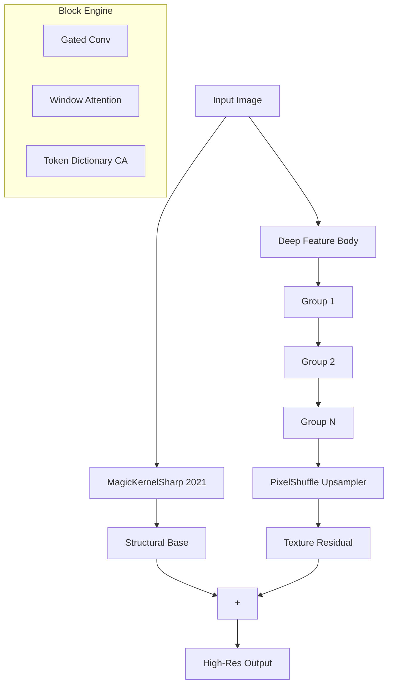

# ParagonSR2: Efficient Dual-Path Super-Resolution

**ParagonSR2** is a "Product-First" Single Image Super-Resolution (SISR) architecture designed to bridge the gap between lightweight CNNs (fast but limited) and modern Transformers (powerful but heavy). It allows for high-fidelity upscaling on consumer hardware.

**Author:** Philip Hofmann
**License:** MIT

> [!TIP]
> **Dev Log & History**: Interested in how this architecture evolved? Check out the [History Folder](history/README.md) to see the journey from the original [ParagonSR](https://github.com/Phhofm/ParagonSR) to **ParagonSR2**.
>
> **Technical Deep Dive**: For a detailed explanation of the architecture design (MagicKernel, Dual-Path strategy), see the [Architecture Docs](traiNNer/archs/README.md).

---

## 🎯 Key Innovations

### 1. Dual-Path Architecture
```
Path A (Base):   LR → MagicKernelSharp → Structural Anchor
Path B (Detail): LR → Deep Body (LR Space) → PixelShuffle → Texture Residual
Output = Base + (Detail × GlobalDetailGain)
```

- **Path A** uses deterministic B-Spline interpolation to anchor structure, preventing geometry warping.
- **Path B** processes in efficient LR space before upsampling via PixelShuffle.


### 2. Specialized Block Engines
- **Realtime (Nano)**: MBConv-based, designed for high-speed mobile/edge upscaling.
- **Stream (Tiny)**: Gated-Conv based with multi-rate context for high-quality video streaming.
- **Photo (Base)**: Hybrid Conv + Shifted Window Attention for general photography.
- **Pro (SOTA)**: The flagship engine. 36 blocks deep, combining local/global attention and Token Dictionary CA for archival-grade restoration.

### 3. Video Mode (Temporal Stabilization)
ParagonSR2 features a native **Feature-Tap Temporal Feedback** loop. By injecting previous frame features into the current pass, it achieves rock-solid stability in video without the flicker common in GAN models.

### 4. Deployment-First Design
**Verdict: "100% TensorRT Compatible"**
Avoids complex ops that break inference engines. Uses standard `PixelShuffle` and `WindowAttention` to ensure immediate deployment on NVIDIA TensorRT and ONNX Runtime.

---

## 📽️ Video Mode Guide

To achieve temporal stabilization, use the following workflow:

1.  **Export Video-Ready ONNX**:
    ```bash
    python scripts/convert_onnx_release.py --arch paragonsr2_photo --scale 2 --video --checkpoint model.safetensors
    ```
2.  **Build Temporal TRT Engine**:
    Provide both `input` and `prev_feat` shapes to `trtexec`:
    ```bash
    trtexec --onnx=model_video.onnx --saveEngine=model.trt --fp16 \
            --minShapes=input:1x3x64x64,prev_feat:1x64x64x64 \
            --optShapes=input:1x3x720x1280,prev_feat:1x64x720x1280 \
            --maxShapes=input:1x3x1080x1920,prev_feat:1x64x1080x1920
    ```
3.  **Run with run_inference.py**:
    The script automatically detects video files and enables temporal stabilization:
    ```bash
    python scripts/run_inference.py --input movie.mp4 --model model.trt --arch paragonsr2_photo --scale 2
    ```

---

## 🚀 Model Variants

| Variant | Parameters | Channels | Blocks | Block Type | Attention | Target |
| :--- | :---: | :---: | :---: | :---: | :---: | :--- |
| **Realtime** | 44,620 | 16 | 3 | NanoBlock | No | High-Speed / Mobile |
| **Stream** | 221,068 | 32 | 6 | StreamBlock | No | High-Bitrate Video |
| **Photo** | 1,188,428 | 64 | 16 | PhotoBlock | Yes | General Photography |
| **Pro** | 2,436,556 | 64 | 36 | ProBlock | Yes | Scientific / Archival |

---

## 📊 Benchmark Results

### Performance (RTX 3060 12GB)
**Test Data:** Urban100 (100 images) | **Task:** 2x Upscaling


---

## 📈 Quality Metrics

Comparative results (2x Scale) on validation datasets. Metrics computed with [pyiqa](https://github.com/chaofengc/IQA-PyTorch).

### Urban100

| Metric | Realtime | Stream | Photo |
| :--- | :---: | :---: | :---: |
| PSNR ↑ | 27.38 | 28.02 | **29.88** |
| PSNR-Y ↑ | 27.56 | 28.23 | **30.15** |
| SSIM ↑ | 0.8777 | 0.8914 | **0.9163** |
| SSIM-C ↑ | 0.8740 | 0.8876 | **0.9124** |
| LPIPS ↓ | 0.1280 | 0.1159 | **0.0654** |
| DISTS ↓ | 0.0943 | 0.0879 | **0.0756** |
| TOPIQ-FR ↑ | 0.7727 | 0.8050 | **0.8527** |

### liu4k

| Metric | Realtime | Stream | Photo |
| :--- | :---: | :---: | :---: |
| PSNR ↑ | 35.00 | 35.68 | **36.23** |
| PSNR-Y ↑ | 35.32 | 36.04 | **36.54** |
| SSIM ↑ | 0.9500 | 0.9544 | **0.9587** |
| SSIM-C ↑ | 0.9483 | 0.9524 | **0.9576** |
| LPIPS ↓ | 0.0801 | 0.0780 | **0.0571** |
| DISTS ↓ | 0.0700 | 0.0669 | **0.0588** |
| TOPIQ-FR ↑ | 0.8506 | 0.8781 | **0.8780** |

### BHI100

| Metric | Realtime | Stream | Photo |
| :--- | :---: | :---: | :---: |
| PSNR ↑ | **8.95** | 8.89 | 8.93 |
| PSNR-Y ↑ | **9.50** | 9.44 | 9.49 |
| SSIM ↑ | **0.1353** | 0.1328 | 0.1329 |
| SSIM-C ↑ | **0.1290** | 0.1266 | 0.1269 |
| LPIPS ↓ | **0.7354** | 0.7326 | 0.7240 |
| DISTS ↓ | 0.3709 | 0.3702 | **0.3636** |
| TOPIQ-FR ↑ | 0.2438 | **0.2447** | 0.2430 |

### psisrd_val125

| Metric | Realtime | Stream | Photo |
| :--- | :---: | :---: | :---: |
| PSNR ↑ | **8.46** | 8.43 | 8.44 |
| PSNR-Y ↑ | **9.29** | 9.25 | 9.26 |
| SSIM ↑ | **0.2504** | 0.2462 | 0.2467 |
| SSIM-C ↑ | **0.2306** | 0.2266 | 0.2274 |
| LPIPS ↓ | **0.8288** | 0.8278 | 0.8353 |
| DISTS ↓ | 0.4215 | 0.4231 | **0.4173** |
| TOPIQ-FR ↑ | **0.2436** | 0.2435 | 0.2420 |

## 🛠️ Quick Start

### 1. Installation
```bash
git clone https://github.com/Phhofm/ParagonSR2.git
cd ParagonSR2
pip install -r requirements.txt
```

### 2. Standard Inference
```bash
python scripts/run_inference.py --input input.png --model model.safetensors --arch paragonsr2_photo --scale 2
```

### 3. Build TensorRT Engine
```bash
# Export to ONNX
python scripts/convert_onnx_release.py --arch paragonsr2_photo --scale 2 --checkpoint model.safetensors

# Build TRT
trtexec --onnx=model.onnx --saveEngine=model.trt --fp16 \
        --minShapes=input:1x3x64x64 \
        --optShapes=input:1x3x720x1280 \
        --maxShapes=input:1x3x1080x1920
```

---

## 📐 Architecture Overview



---

## ⚖️ Recommended Discriminators
For training the GAN variant, the following are recommended:
- **Multi-Scale Discriminator (MSD)**: Best for global structure.
- **UNet Discriminator**: Superior for local texture consistency.

---

## 💻 Hardware & Development
- **Dev System:** Ubuntu 22.04 | CUDA 12.1 | RTX 3060 12GB
- **Core Dependencies:** PyTorch 2.3+, OpenCV, NumPy, ONNXRuntime

---

## ⚙️ Key Parameters

| Parameter | Default | Description |
| :--- | :--- | :--- |
| `scale` | 4 | Upscaling factor (2, 3, 4, 8) |
| `upsampler_alpha` | 0.4 | Base sharpening (0.0=Soft, 0.4=Balanced, 1.0=Sharp) |
| `attention_mode` | 'sdpa' | Options: `sdpa` (standard), `flex` (PyTorch native) |
| `export_safe` | False | Disables attention for strict ONNX compatibility |

---

## 🤖 AI-Assisted Research

The architecture of ParagonSR2 was developed through hundreds of iterations, supercharged by next-gen AI models. We explored a vast space of architectural patterns—from Hybrid-CNN-Transformers to Recurrent Context Gatherers—before arriving at the current production-ready design.

**Models used for exploration:**
- Claude 3.5 Sonnet / Opus
- Gemini 3 Pro / Flash
- GPT-4o / o1-preview
- MiniMax-M2 / Grok Code Fast

---

## 📜 Citation

```bibtex
@software{paragonsr2,
  author = {Philip Hofmann},
  title = {ParagonSR2: Efficient Dual-Path Super-Resolution},
  year = {2024},
  url = {https://github.com/Phhofm/ParagonSR2}
}
```
