# ParagonSR2: Efficient Dual-Path Super-Resolution

**ParagonSR2** is a "Product-First" Single Image Super-Resolution (SISR) architecture designed to bridge the gap between lightweight CNNs (fast but limited) and modern Transformers (powerful but heavy). It allows for high-fidelity upscaling on consumer hardware.

**Author:** Philip Hofmann
**License:** MIT

> [!TIP]
> **Dev Log & History**: Interested in how this architecture evolved? Check out the [History Folder](history/README.md) to see the journey from the original [ParagonSR](https://github.com/Phhofm/ParagonSR) to **ParagonSR2**.
>
> **Technical Deep Dive**: For a detailed explanation of the architecture design (MagicKernel, Dual-Path strategy), see the [Architecture Docs](traiNNer/archs/README.md).

---

## 🎯 Key Innovations

### 1. Dual-Path Architecture
```
Path A (Base):   LR → MagicKernelSharp → Structural Anchor
Path B (Detail): LR → Deep Body (LR Space) → PixelShuffle → Texture Residual
Output = Base + (Detail × GlobalDetailGain)
```

- **Path A** uses deterministic B-Spline interpolation to anchor structure, preventing geometry warping.
- **Path B** processes in efficient LR space before upsampling via PixelShuffle.


### 2. Specialized Block Engines
- **Realtime (Nano)**: MBConv-based for maximum throughput.
- **Stream (Tiny)**: Multi-rate context gathering for de-blocking.
- **Photo (Base)**: Hybrid Convolution + Selective Window Attention.
- **Pro (State-of-the-Art)**: Comprehensive engine with local/global attention and deep body.

### 3. Deployment-First Design
**Verdict: "100% TensorRT Compatible"**
The architecture is designed to avoid complex ops that break inference engines. It uses standard `PixelShuffle` and simplified `WindowAttention` to ensure immediate deployment on ONNX Runtime and TensorRT.

### 4. FlexAttention Suite (Training Speed)
By supporting `flex_attention`, the architecture achieves the fastest possible training on modern NVIDIA GPUs while falling back to standard SDPA for broad compatibility.

### 5. Version 11 Quality Boost
The latest version 11 introduces **Token Dictionary Cross-Attention** (for global texture understanding) and extreme depth (36 blocks) for the Pro variant, pushing the boundaries of what's possible on consumer hardware.

---

## 🚀 Model Variants

| Variant | Code Name | Parameters | Channels | Blocks | Block Type | Attention | Target |
|---------|-----------|------------|----------|--------|------------|-----------|--------|
| **Realtime** | `paragonsr2_realtime` | 44,620 | 16 | 3 | Nano | No | Video/Anime |
| **Stream** | `paragonsr2_stream` | 221,068 | 32 | 6 | Stream | No | Compressed video / HD |
| **Photo** | `paragonsr2_photo` | 1,188,428 | 64 | 16 | Photo | Yes | General photography |
| **Pro** | `paragonsr2_pro` | 2,436,556 | 64 | 36 | Pro | Yes | Scientific / Archival / SOTA |

---

## 📊 Benchmark Results

Benchmarked on **Urban100 (100 images, varied sizes)** at **2x Scale**.

### Realtime Variant (`paragonsr2_realtime`)
**Hardware:** NVIDIA GeForce RTX 3060 (11.6 GB)

| Backend | Avg Latency | FPS | Peak VRAM |
|---------|-------------|-----|-----------|
| PyTorch FP32 | 84.4 ms | 11.8 | 0.25 GB |
| PyTorch FP16 | 86.8 ms | 11.5 | 0.09 GB |
| PyTorch FP16 (Compiled) | 46.6 ms | 21.5 | 0.08 GB |
| **TensorRT FP16** | **2.3 ms** | **431.4** | **0.03 GB** |

### Stream Variant (`paragonsr2_stream`)
**Hardware:** NVIDIA GeForce RTX 3060 (11.6 GB)

| Backend | Avg Latency | FPS | Peak VRAM |
|---------|-------------|-----|-----------|
| PyTorch FP32 | 217.3 ms | 4.6 | 0.49 GB |
| PyTorch FP16 | 192.2 ms | 5.2 | 0.21 GB |
| PyTorch FP16 (Compiled) | 96.7 ms | 10.3 | 0.17 GB |
| **TensorRT FP16** | **10.0 ms** | **100.5** | **0.03 GB** |

## Benchmark: `paragonsr2_photo` (2x)

**Hardware:** NVIDIA GeForce RTX 3060 (11.6 GB)  
**Dataset:** Urban100 LRx2 (100 images, varied sizes)

| Backend | Avg Latency | FPS | Peak VRAM |
|---------|-------------|-----|-----------|
| PyTorch FP16 (No Attn) | 159.2 ms | 6.3 | 0.42 GB |
| PyTorch FP16 (No Attn) (Compiled) | 164.6 ms | 6.1 | 0.38 GB |
| PyTorch FP16 (SDPA) | 171.1 ms | 5.8 | 0.65 GB |
| PyTorch FP16 (SDPA) (Compiled) | 97.6 ms | 10.3 | 0.39 GB |
| PyTorch FP16 (Flex) | 1061.7 ms | 0.9 | 4.50 GB |
| PyTorch FP16 (Flex) (Compiled) | 85.3 ms | 11.7 | 0.39 GB |
| TensorRT FP16 | 39.5 ms | 25.3 | 0.03 GB |

---

## 📈 Quality Metrics (2x Fidelity Models)

Evaluated using `PyIQA` across standard and custom datasets.

### Urban100
| Variant | PSNR | PSNR-Y | SSIM | LPIPS | DISTS | TOPIQ |
|---------|------|--------|------|-------|-------|-------|
| **Realtime** | 27.38 | 27.56 | 0.8777 | 0.1280 | 0.0943 | 0.7727 |
| **Stream**   | 28.02 | 28.23 | 0.8914 | 0.1159 | 0.0879 | 0.8050 |
| **Photo**    | 29.88 | 30.15 | 0.9163 | 0.0654 | 0.0756 | 0.8527 |

### liu4k (Validation)
| Variant | PSNR | PSNR-Y | SSIM | LPIPS | DISTS | TOPIQ |
|---------|------|--------|------|-------|-------|-------|
| **Realtime** | 35.00 | 35.32 | 0.9500 | 0.0801 | 0.0700 | 0.8506 |
| **Stream**   | 35.68 | 36.04 | 0.9544 | 0.0780 | 0.0669 | 0.8781 |
| **Photo**    | 36.23 | 36.54 | 0.9587 | 0.0571 | 0.0588 | 0.8780 |

### BHI100
| Variant | PSNR | PSNR-Y | SSIM | LPIPS | DISTS | TOPIQ |
|---------|------|--------|------|-------|-------|-------|
| **Realtime** | 8.95 | 9.50 | 0.1353 | 0.7354 | 0.3709 | 0.2438 |
| **Stream**   | 8.89 | 9.44 | 0.1328 | 0.7326 | 0.3702 | 0.2447 |
| **Photo**    | 8.93 | 9.49 | 0.1329 | 0.7240 | 0.3636 | 0.2430 |

### psisrd_val125
| Variant | PSNR | PSNR-Y | SSIM | LPIPS | DISTS | TOPIQ |
|---------|------|--------|------|-------|-------|-------|
| **Realtime** | 8.46 | 9.29 | 0.2504 | 0.8288 | 0.4215 | 0.2436 |
| **Stream**   | 8.43 | 9.25 | 0.2462 | 0.8278 | 0.4231 | 0.2435 |
| **Photo**    | 8.44 | 9.26 | 0.2467 | 0.8353 | 0.4173 | 0.2420 |


---

## ⚡ Quick Start

### ONNX & TensorRT Export Flow
To achieve the speeds shown above, follow this workflow:

1. **Convert to ONNX**:
```bash
python scripts/convert_onnx_release.py \
    --checkpoint "paragonsr2/2xParagonSR2_Stream_fidelity.safetensors" \
    --arch paragonsr2_stream \
    --output "paragonsr2_onnx" \
    --scale 2 \
    --upsampler_alpha 0.0 \
    --dynamic \
    --val_dir /home/phips/Documents/dataset/Urban100/HR \
    --export_safe true
```

If creating onnx for video purposes, add --video flag to enable temporal consistency.

Upsampler alpha is set to 0.0 for fidelity, but you can adjust it to 0.3-0.6 for GAN-like sharpening or just use and leave defaults.

2. **Build TensorRT Engine**:
```bash
trtexec --onnx=paragonsr2_onnx/paragonsr2_stream_fp32.onnx \
        --saveEngine=paragonsr2_onnx/paragonsr2_stream_fp16.trt \
        --fp16 \
        --minShapes=input:1x3x64x64 \
        --optShapes=input:1x3x720x1280 \
        --maxShapes=input:1x3x1080x1920
```
Building dynamic tensorRT engine for photo variant is pretty demanding, so with my rtx 3060 12gb vram i went with this command:

trtexec --onnx=release_onnx/paragonsr2_photo_fp32.onnx \
        --saveEngine=release_onnx/paragonsr2_photo_fp16.trt \
        --fp16 \
        --minShapes=input:1x3x64x64 \
        --optShapes=input:1x3x512x512 \
        --maxShapes=input:1x3x720x720 \
        --memPoolSize=workspace:4096


If onnx was created with --video for temporal consistency, run with additional prev_feat input:

trtexec --onnx=release_onnx/paragonsr2_photo_fp32.onnx \
        --saveEngine=release_onnx/paragonsr2_photo_fp16.trt \
        --fp16 \
        --minShapes=input:1x3x64x64,prev_feat:1x64x64x64 \
        --optShapes=input:1x3x512x512,prev_feat:1x64x512x512 \
        --maxShapes=input:1x3x720x720,prev_feat:1x64x720x720 \
        --memPoolSize=workspace:4096

3. **Run Benchmark**:
```bash
python scripts/benchmark_release.py \
    --input /path/to/dataset \
    --scale 2 \
    --pt_model paragonsr2/2xParagonSR2_Stream_fidelity.safetensors \
    --arch paragonsr2_stream \
    --trt_engine paragonsr2_onnx/paragonsr2_stream_fp16.trt
```

---

## ⚙️ Key Parameters

| Parameter | Default | Description |
|-----------|---------|-------------|
| `scale` | 4 | Upscaling factor (2, 3, 4, or 8) |
| `upsampler_alpha` | 0.4 | Base path sharpening. `0.0` = Fidelity, `0.3-0.6` = GAN |
| `detail_gain` | 0.1 | Initial learnable multiplier for the detail path |
| `attention_mode` | 'sdpa' | Choice of attention kernel (`sdpa` or `flex`) |
| `use_checkpointing` | False | Enable activation checkpointing to save VRAM |
| `export_safe` | False | Disables attention ops specifically for restricted ONNX export |

---

## 🏗️ Architecture Diagram

```mermaid
graph TD
    LR[LR Input] --> Base[MagicKernelSharp Upsampler]
    LR --> Conv[Feature Extraction]

    subgraph "Detail Path (LR Space)"
        Conv --> Body[Residual Groups]
        Body --> Fuse[Conv Fuse]
        Fuse --> CAG[Content-Aware Gating]
    end

    CAG --> PS[Progressive PixelShuffle]
    PS --> Out[Detail Conv]
    Out --> Gain[× Global Detail Gain]

    Base --> Add((+))
    Gain --> Add
    Add --> HR[HR Output]
```



---

## 📊 Recommended Discriminators

For GAN training, I highly recommend using **MUNet** (coming soon), a custom discriminator designed to work well with ParagonSR2's dual-path output.

| Generator Variant | MUNet Config |
|------------------|--------------|
| Realtime / Stream | `num_feat=32, ch_mult=(1, 2, 2)` |
| Photo | `num_feat=64, ch_mult=(1, 2, 4, 8)` |

---

## 🖥️ Hardware & Development

> **"Built on Consumer Hardware, for Consumer Hardware"**

All development, training, testing, and benchmarking for ParagonSR2 was performed on a standard home PC. This confirms that you don't need a massive H100 cluster to train or deploy these models.

### System Specs
- **GPU**: NVIDIA GeForce RTX 3060 (12 GB VRAM)
- **CPU**: AMD Ryzen 5 3600 (6-core)
- **RAM**: 16 GB DDR4
- **OS**: Ubuntu 24.10

---

## 🤖 AI-Assisted Development

The development of ParagonSR2 was highly iterative and explored many "what if" scenarios. This exploration was supercharged by next-gen AI coding assistants.

**Models & Tools used during development:**
- **Models**: MiniMax-M2, Gemini 3 Pro, Gemini 3 Flash, Claude Opus 4.5 Thinking, Claude Sonnet 4.5 Thinking, Gemini 2.5 Pro, Gemini Flash Deep Research, Grok Code Fast, GPT's and more.
- **Platforms**: Antigravity, Kilo Code, OpenRouter.

These tools helped prototype weird ideas (like "what if we mix ConvNext with Swin but run it in LR space?") rapidly, allowing me to filter out bad architectural decisions much faster than traditional coding.

---

## 📜 Citation

If you use ParagonSR2 in your research or project, please cite:

```bibtex
@software{paragonsr2,
  author = {Philip Hofmann},
  title = {ParagonSR2: Efficient Dual-Path Super-Resolution},
  year = {2024},
  url = {https://github.com/Phhofm/ParagonSR2}
}
```
