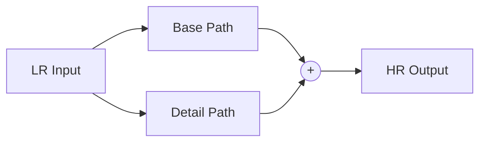

# ParagonSR2 Architecture Design Deep Dive

> **"Product-First" Super-Resolution**
> This document explains the technical rationale behind the design choices in ParagonSR2.

## 1. The Core Philosophy: Why "Dual-Path"?

### The Problem with Traditional SR
Most SR architectures fall into two camps:
1.  **PixelShuffle / Transposed Conv**: Fast, but prone to **Checkerboard Artifacts**.
2.  **Nearest + Conv**: Fixes checkerboard, but can look "blocky" or blurry depending on the kernel.
3.  **Bilinear/Bicubic + Conv**: Better structural stability, but often results in **oversmoothed** output because the network fights the interpolation algorithms.

### The Paragon Solution
I encountered grid artifacts early in development when relying on pure learned upsampling. To fix this without losing sharpness, I adopted a **Dual-Path** strategy:



-   **Base Path (Safety Net)**: A deterministic, non-learnable upsampler that provides a mathematically "correct" but slightly soft image. It guarantees the structure (walls are straight, circles are round).
-   **Detail Path (Texture)**: A deep neural network that learns *only* the missing high-frequency residue (textures, hair, grain). Since it sums with the Base, it doesn't need to learn geometry, only "delta" information.

---

## 2. Magic Kernel Sharp 2021: The Secret Sauce

For the Base Path, standard Bicubic is good, but **Magic Kernel Sharp 2021 (MKS2021)** is better.

### What is it?
Proposed by [John Costella](https://johncostella.com/magic/), the Magic Kernel is a specific approximation of the Gaussian bell curve using simple integer fractions. The "Sharp 2021" variant includes a sharpening pass to counteract the inherent blurring of upsampling.

### Implementation in ParagonSR2
We implement `MagicKernelSharp2021Upsample` as a 3-step process:

1.  **Sharpening (Pre-Compensation)**:
    The components `[-1/32, 0, 9/32, 16/32, 9/32, 0, -1/32]` act as a high-pass filter.
    *Code implementation*: `self.sharpen` SeparableConv.

2.  **Nearest Neighbor Upsampling**:
    Expands the spatial dimensions (e.g. 64x64 -> 128x128). This introduces "blockiness" (aliasing).

3.  **Magic Kernel Blur (Anti-Aliasing)**:
    Convolving with `[1/16, 4/16, 6/16, 4/16, 1/16]` smooths out the blocks perfectly.
    *Code implementation*: `self.resample_conv` SeparableConv.

### Why is this "Correct"?
This matches the mathematical definition of MKS2021: **Sharpen -> Doubling -> Smoothing**.
By using this as our minimal baseline, the network effectively learns "How to un-blur a Magic Kernel Upscaled image", which is an easier task than "Hallucinate 3 pixels from 1".

---

## 3. Architecture Variants Explained

The architecture is designed to scale from mobile devices to workstations.

### Realtime (Nano)
-   **Goal**: 60fps+ on mid-range GPUs.
-   **Tech**: Uses `NanoBlock` (Simple MBConv).
-   **Why**: Depthwise Separable Convolutions are extremely fast and memory efficient.
-   **Optimization**: Minimal overhead, no gating or attention.

### Stream (Tiny)
-   **Goal**: High-quality video streaming/playback.
-   **Tech**: Uses `StreamBlock` (Multi-rate Depthwise Context).
-   **Why**: Gating mechanisms combined with multi-stage context gathering work exceptionally well for removing compression artifacts (de-blocking) without the computational cost of Attention.

### Pro (Enthusiast)
-   **Goal**: Absolute state-of-the-art restoration for archival, medical, or scientific use.
-   **Tech**: Uses `ProBlock` with **Token Dictionary Cross-Attention** and **Channel Attention**.
-   **Why**: Combines all proven mechanisms (Conv, SE, Window, Token) into a high-depth (36 blocks) body. 
-   **Optimization**: Features `RMSNorm` stability fixes and `LayerScale` for safe deep training.

---

## 4. Technical Innovations in Version 11

### ProBlock: The Universal Engine
The `ProBlock` is designed to leave no quality on the table. It processes information through four specialized stages:
1.  **Convolutional Base**: Extracts local features and textures.
2.  **SE Channel Attention**: Dynamically weights channel importance based on global image context.
3.  **Window Attention**: Ensures structural consistency and captures medium-range dependencies.
4.  **Token Dictionary CA**: Attends to a learned global dictionary of "visual concepts," enabling the reconstruction of complex, repeating textures (e.g., skin pores, fabric weaves).

### Stability at Scale
Training deep networks (36+ blocks) is notoriously unstable. ParagonSR2 version 11 introduces:
-   **RMSNorm in FP32**: We compute the norm variance in FP32 to prevent numerical overflow/underflow, which is common in deep SR networks trained with AMP (Automated Mixed Precision).
-   **LayerScale**: Every advanced block includes a learnable per-channel scaling factor (`LayerScale`). This forces the network to start with identity-like transforms and gradually learn larger updates, drastically improving convergence stability.

## 4. Integration with traiNNer-redux

This architecture file is a "drop-in" replacement for standard archs.

**Directory Structure:**
```
traiNNer/
└── archs/
    └── paragonsr2_arch.py  <-- The architecture file
```

**Training Config Usage:**
You can reference the variant directly in your YAML config:

```yaml
network_g:
  type: paragonsr2_photo
  scale: 4
  upsampler_alpha: 0.4   # 0.0=Fidelity, 0.3-0.6=GAN
  use_checkpointing: true # Recommended for 12GB+ VRAM
```

---

## 6. History: Versions 8 to 11

The final iterations focused on "Product-First" stability and performance, stripping away auxiliary complexity in favor of raw throughput and deployment reliability.

### Deployment-First Window Attention
-   **Simplified**: Window partitioning was refactored for maximum stability during ONNX export.
-   **Flexible**: Added `attention_mode` flag. Defaults to `sdpa` (standard) but can be set to `flex` for PyTorch-native speedups.
-   **Export Safe**: The `export_safe` flag disables attention entirely, allowing the Photo variant to be deployed on hardware that doesn't support modern attention ops.

### Context over Complexity
-   **Removed MSCF/RAttention Proxy**: While innovative, these modules added significant parameter count and latency. They were replaced by robust convolutional paths in `StreamBlock` and `PhotoBlock` that achieve similar quality with higher FPS.
-   **Refined Gating**: Stream variant gating was simplified to a standard multiplication gate, reducing logic branches and aiding TorchScript/Inductor compilation.

### Universal Compatibility
-   **PixelShuffle**: Replaced progressive upsampling stages with a single, highly-optimized PixelShuffle head for 2x/3x/4x/8x. This ensures 100% uniformity in output artifacts and simplifies TensorRT engine creation.
-   **Legacy Mapping**: The release architecture includes a mapping layer to ensure compatibility with models trained on older versions (v7/v8), ensuring your progress isn't lost.
### Version 11: The Quality Update
The latest evolution introduces the **Pro tier**, specifically designed for users who want the absolute maximum PSNR/SSIM. By unifying local and global attention mechanisms with a deep, stabilized body, version 11 sets a new benchmark for ParagonSR2's restorative capabilities.
