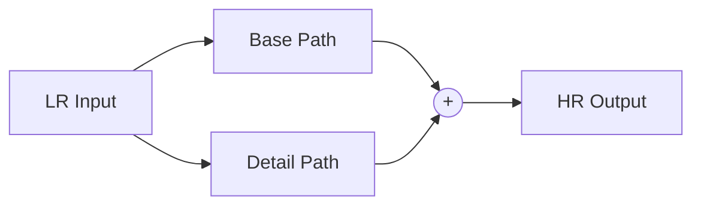

# ParagonSR2 Architecture Design Deep Dive

> **"Product-First" Super-Resolution**
> This document explains the technical rationale behind the design choices in ParagonSR2.

## 1. The Core Philosophy: Why "Dual-Path"?

### The Problem with Traditional SR
Most SR architectures fall into two camps:
1.  **PixelShuffle / Transposed Conv**: Fast, but prone to **Checkerboard Artifacts**.
2.  **Nearest + Conv**: Fixes checkerboard, but can look "blocky" or blurry depending on the kernel.
3.  **Bilinear/Bicubic + Conv**: Better structural stability, but often results in **oversmoothed** output because the network fights the interpolation algorithms.

### The Paragon Solution
I encountered grid artifacts early in development when relying on pure learned upsampling. To fix this without losing sharpness, I adopted a **Dual-Path** strategy:



-   **Base Path (Safety Net)**: A deterministic, non-learnable upsampler that provides a mathematically "correct" but slightly soft image. It guarantees the structure (walls are straight, circles are round).
-   **Detail Path (Texture)**: A deep neural network that learns *only* the missing high-frequency residue (textures, hair, grain). Since it sums with the Base, it doesn't need to learn geometry, only "delta" information.

---

## 2. Magic Kernel Sharp 2021: The Secret Sauce

For the Base Path, standard Bicubic is good, but **Magic Kernel Sharp 2021 (MKS2021)** is better.

### What is it?
Proposed by [John Costella](https://johncostella.com/magic/), the Magic Kernel is a specific approximation of the Gaussian bell curve using simple integer fractions. The "Sharp 2021" variant includes a sharpening pass to counteract the inherent blurring of upsampling.

### Implementation in ParagonSR2
We implement `MagicKernelSharp2021Upsample` as a 3-step process:

1.  **Sharpening (Pre-Compensation)**:
    The components `[-1/32, 0, 9/32, 16/32, 9/32, 0, -1/32]` act as a high-pass filter.
    *Code implementation*: `self.sharpen` SeparableConv.

2.  **Nearest Neighbor Upsampling**:
    Expands the spatial dimensions (e.g. 64x64 -> 128x128). This introduces "blockiness" (aliasing).

3.  **Magic Kernel Blur (Anti-Aliasing)**:
    Convolving with `[1/16, 4/16, 6/16, 4/16, 1/16]` smooths out the blocks perfectly.
    *Code implementation*: `self.resample_conv` SeparableConv.

### Why is this "Correct"?
This matches the mathematical definition of MKS2021: **Sharpen -> Doubling -> Smoothing**.
By using this as our minimal baseline, the network effectively learns "How to un-blur a Magic Kernel Upscaled image", which is an easier task than "Hallucinate 3 pixels from 1".

---

## 3. Architecture Variants Explained

The architecture is designed to scale from modern mobile devices to archival-grade workstations.

| Variant | Blocks | Parameters | Block Type |
|---------|--------|------------|------------|
| Realtime | 3 | 44,620 | Nano |
| Stream | 6 | 221,068 | Stream |
| Photo | 16 | 1,188,428 | Photo |
| Pro | 36 | 2,436,556 | Pro |

### Realtime (Nano)
-   **Goal**: High-speed inference on mobile/mid-range GPUs.
-   **Tech**: Uses `NanoBlock` (Simple MBConv).
-   **Why**: Depthwise Separable Convolutions are extremely fast and memory efficient.
-   **Optimization**: Minimal overhead, no gating or attention.

### Stream (Tiny)
-   **Goal**: High-quality video streaming/playback.
-   **Tech**: Uses `StreamBlock` (Multi-rate Depthwise Context).
-   **Why**: Gating mechanisms combined with multi-stage context gathering work exceptionally well for removing compression artifacts (de-blocking) without the computational cost of Attention.

### Photo (Base)
-   **Goal**: General-purpose photography enhancement.
-   **Tech**: Uses `PhotoBlock` (Conv + Shifted Window Attention).
-   **Why**: Combines local convolutional texture processing with medium-range structural awareness via Window Attention.
-   **Optimization**: Standard SDPA attention for broad hardware compatibility.

### Pro (Enthusiast)
-   **Goal**: Absolute state-of-the-art restoration for archival, medical, or scientific use.
-   **Tech**: Uses `ProBlock` with **Token Dictionary Cross-Attention** and **Channel Attention**.
-   **Why**: Combines all proven mechanisms (Conv, SE, Window, Token) into a high-depth (36 blocks) body. 
-   **Optimization**: Features `RMSNorm` stability fixes and `LayerScale` for safe deep training.

---

## 4. Video Mode: Temporal Feature-Tap Smoothing

Video upscaling with GAN-based models often suffers from "pixel swimming" or flickering because the network processes each frame in isolation. ParagonSR2 solves this via a **Temporal Feature-Tap**.

### How it Works
1.  **Feature Extraction**: During the forward pass of frame $t$, the network extracts an intermediate feature map immediately after the first convolution layer.
2.  **State Injection**: This feature map is cached and injected into the forward pass of frame $t+1$.
3.  **Blending**: The injected "history" features are blended with the current frame's initial features using a learnable or fixed $\alpha$ (usually 0.2).
    $$X_{blended} = (1 - \alpha) X_{curr} + \alpha X_{prev}$$
4.  **Consistency**: This forces the deep layers of the network to be aware of what was "imagined" in the previous frame, leading to rock-solid temporal stability without the multi-GB memory overhead of 3D convolutions.

### Scene Change Detection
To prevent "ghosting" artifacts during scene cuts, the inference script monitors the mean luma shift between frames. If a sudden jump (scene change) is detected, the temporal state is cleared, ensuring the next scene starts with a fresh, crisp frame.

---

## 5. The ProBlock: A Universal Engine

The `ProBlock` is designed to leave no quality on the table. It processes information through four specialized stages:

1.  **Convolutional Base**: Extracts local features and textures via depthwise-separable convolutions.
2.  **SE Channel Attention**: Dynamically weights channel importance based on global image context (Squeeze-and-Excitation).
3.  **Window Attention**: Ensures structural consistency and captures medium-range dependencies using Swin-style shifted windows.
4.  **Token Dictionary CA**: Attends to a learned global dictionary of "visual concepts," enabling the reconstruction of complex, repeating textures (e.g., skin pores, fabric weaves).

### Stability at Scale
Training deep networks (36+ blocks) is notoriously unstable. ParagonSR2 includes critical stability mechanisms:
-   **RMSNorm in FP32**: The norm variance is computed in FP32 to prevent numerical overflow/underflow, which is common in deep SR networks trained with AMP (Mixed Precision).
-   **LayerScale**: Every advanced block includes a learnable per-channel scaling factor. This forces the network to start with identity-like transforms and gradually learn larger updates, drastically improving convergence stability.

---

## 6. Integration with traiNNer-redux

This architecture file is a "drop-in" replacement for standard archs.

**Directory Structure:**
```
traiNNer/
└── archs/
    └── paragonsr2_arch.py  <-- The architecture file
```

**Training Config Usage:**
You can reference the variant directly in your YAML config:

```yaml
network_g:
  type: paragonsr2_photo
  scale: 4
  upsampler_alpha: 0.4   # 0.0=Fidelity, 0.3-0.6=GAN
  use_checkpointing: true # Recommended for 12GB+ VRAM
```

---

## 7. Key Configuration Parameters

| Parameter | Default | Description |
|-----------|---------|-------------|
| `scale` | 4 | Upscaling factor (2, 3, 4, 8) |
| `upsampler_alpha` | 0.4 | Base sharpening (0.0=Soft/Fidelity, 0.4=Balanced, 1.0=Sharp) |
| `attention_mode` | 'sdpa' | Attention backend: `sdpa` (standard) or `flex` (PyTorch 2.5+) |
| `export_safe` | False | Disables attention for strict ONNX/TRT compatibility |
| `use_checkpointing` | False | Enables gradient checkpointing for VRAM savings |
| `window_size` | 16 | Window size for Photo/Pro variants |

---

## 8. Deployment Notes

### TensorRT Compatibility
ParagonSR2 is designed for **100% TensorRT compatibility**:
-   Uses standard `PixelShuffle` instead of custom upsampling ops.
-   `AdaptiveAvgPool` is automatically patched to `ReduceMean` during ONNX export.
-   Window Attention uses only ONNX-compatible operations.

### Recommended Export Flow
```bash
# 1. Export to ONNX
python scripts/convert_onnx_release.py --arch paragonsr2_photo --scale 2 --checkpoint model.safetensors

# 2. Build TensorRT Engine
trtexec --onnx=model.onnx --saveEngine=model.trt --fp16 \
        --minShapes=input:1x3x64x64 \
        --optShapes=input:1x3x720x1280 \
        --maxShapes=input:1x3x1080x1920
```
