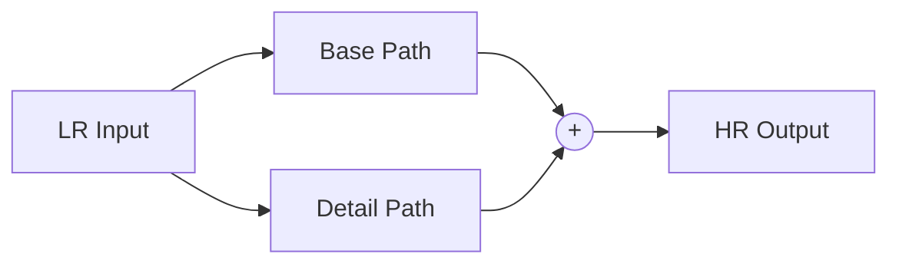

# ParagonSR2 Architecture Design Deep Dive

> **"Product-First" Super-Resolution**
> This document explains the technical rationale behind the design choices in ParagonSR2.

## 1. The Core Philosophy: Why "Dual-Path"?

### The Problem with Traditional SR
Most SR architectures fall into two camps:
1.  **PixelShuffle / Transposed Conv**: Fast, but prone to **Checkerboard Artifacts**.
2.  **Nearest + Conv**: Fixes checkerboard, but can look "blocky" or blurry depending on the kernel.
3.  **Bilinear/Bicubic + Conv**: Better structural stability, but often results in **oversmoothed** output because the network fights the interpolation algorithms.

### The Paragon Solution
I encountered grid artifacts early in development when relying on pure learned upsampling. To fix this without losing sharpness, I adopted a **Dual-Path** strategy:



-   **Base Path (Safety Net)**: A deterministic, non-learnable upsampler that provides a mathematically "correct" but slightly soft image. It guarantees the structure (walls are straight, circles are round).
-   **Detail Path (Texture)**: A deep neural network that learns *only* the missing high-frequency residue (textures, hair, grain). Since it sums with the Base, it doesn't need to learn geometry, only "delta" information.

---

## 2. Magic Kernel Sharp 2021: The Secret Sauce

For the Base Path, standard Bicubic is good, but **Magic Kernel Sharp 2021 (MKS2021)** is better.

### What is it?
Proposed by [John Costella](https://johncostella.com/magic/), the Magic Kernel is a specific approximation of the Gaussian bell curve using simple integer fractions. The "Sharp 2021" variant includes a sharpening pass to counteract the inherent blurring of upsampling.

### Implementation in ParagonSR2
We implement `MagicKernelSharp2021Upsample` as a 3-step process:

1.  **Sharpening (Pre-Compensation)**:
    The components `[-1/32, 0, 9/32, 16/32, 9/32, 0, -1/32]` act as a high-pass filter.
    *Code implementation*: `self.sharpen` SeparableConv.

2.  **Nearest Neighbor Upsampling**:
    Expands the spatial dimensions (e.g. 64x64 -> 128x128). This introduces "blockiness" (aliasing).

3.  **Magic Kernel Blur (Anti-Aliasing)**:
    Convolving with `[1/16, 4/16, 6/16, 4/16, 1/16]` smooths out the blocks perfectly.
    *Code implementation*: `self.resample_conv` SeparableConv.

### Why is this "Correct"?
This matches the mathematical definition of MKS2021: **Sharpen -> Doubling -> Smoothing**.
By using this as our minimal baseline, the network effectively learns "How to un-blur a Magic Kernel Upscaled image", which is an easier task than "Hallucinate 3 pixels from 1".

---

## 3. Architecture Variants Explained

The architecture is designed to scale from mobile devices to workstations.

### Realtime (Nano)
-   **Goal**: 60fps on mid-range GPUs.
-   **Tech**: Uses `MBConv` (Mobile Inverted Bottleneck Convolution).
-   **Why**: Depthwise Separable Convolutions are extremely fast and memory efficient.
-   **Trade-off**: Lower capacity, struggles with complex textures.

### Stream (Tiny)
-   **Goal**: High-quality video streaming/playback.
-   **Tech**: Uses `SimpleGateBlock` (Gated Feed-Forward Network).
-   **Why**: Gating mechanisms work exceptionally well for removing compression artifacts (de-blocking) without the computational cost of Attention.

### Photo (Base)
-   **Goal**: Best possible single-image restoration.
-   **Tech**: Uses `ParagonBlock` with **Shifted Window Attention**.
-   **Why**: Convolution (local) sees edges. Attention (global) sees patterns.
    -   *Example*: Convolution sees a repeating line. Attention understands it's a "brick wall" and ensures the pattern continues consistently across the image.
    -   **Swin-style Shift**: We alternate window shifts (0, window_size//2) to allow information to flow between windows, preventing grid artifacts in the attention map.

---

## 4. Integration with traiNNer-redux

This architecture file is a "drop-in" replacement for standard archs.

**Directory Structure:**
```
traiNNer/
└── archs/
    └── paragonsr2_arch.py  <-- The architecture file
```

**Training Config Usage:**
You can reference the variant directly in your YAML config:

```yaml
network_g:
  type: paragonsr2_photo
  scale: 4
  upsampler_alpha: 0.5   # Tune this! 0.0=Soft, 1.0=SharpBase
  upsampler_alpha: 0.5   # Tune this! 0.0=Soft, 1.0=SharpBase
  use_checkpointing: true # Recommended for 12GB+ VRAM
```

---

## 5. Version 7 Enhancements (Performance & Compatibility)

The "v7" update introduced several focused improvements to maximize training throughput without breaking deployment compatibility.

### FlexAttention and RPB Fusion
-   **Why**: Calculating attention and *then* adding Relative Position Bias (RPB) involves creating large intermediate tensors, which slows down training.
-   **Solution**: We use `torch.nn.attention.flex_attention` with a `score_mod` closure. This fuses the RPB addition *inside* the attention kernel itself.
-   **Result**: Zero memory overhead for RPB and maximum utilization of Tensor Cores.

### Intelligent Fallback
-   **Why**: FlexAttention is amazing for PyTorch but doesn't export cleanly to ONNX/TensorRT yet (requires custom plugins).
-   **Solution**: The model detects `torch.onnx.is_in_onnx_export()` and automatically swaps the attention implementation to standard `MatMul + Add + Softmax`.
-   **Result**: You get the training speed of FlexAttention AND the deployment simplicity of standard operators.

### RAttention (Region-Aware Context)
-   **Problem**: Sliding windows in pure Transformers sometimes miss context from outside the window, leading to discontinuities.
-   **Correction**: Instead of expensive recurrent RAttention, we use a **3x3 Depthwise Convolution** on the Keys/Values (K/V) *before* window partitioning.
-   **Effect**: This "leaks" information from neighboring windows into the current window's attention mechanism, expanding the effective receptive field significantly with negligible cost.

### MSCF (Multi-Scale Cross-Fusion)
-   **Feature**: Replaced simple channel attention with a multi-branch aggregation block (1x1, 3x3, 5x5 kernels).
-   **Benefit**: The network can "decide" whether to focus on fine details (1x1), textures (3x3), or structures (5x5) when modulating the feature channels.
